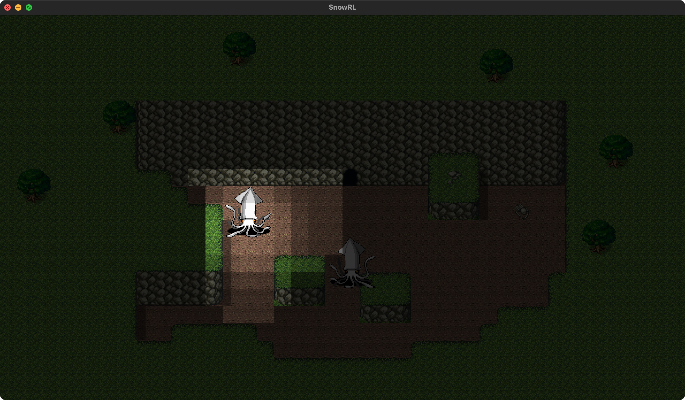

= SnowRL devlog
:toc:
:toy: https://github.com/toyboot4e/
:rokol: https://github.com/toyboot4e/rokol[rokol]
:Rust-FNA3D: https://github.com/toyboot4e/Rust-FNA3D[Rust-FNA3D]
:FNA3D: https://github.com/FNA-XNA/FNA3D[FNA3D]
:Sokol: https://github.com/floooh/sokol[sokol]
:sokol-gl: https://github.com/floooh/sokol/blob/master/util/sokol_gl.h[sokol_gl.h]
:zig-gamekit: https://github.com/prime31/zig-gamekit[zig-gamekit]
:rust-gen: https://doc.rust-lang.org/beta/unstable-book/language-features/generators.html[Generators]
:learn-gl-sokol: https://www.geertarien.com/learnopengl-examples-html5/[Learn OpenGL Examples]
:gen-arena: https://docs.rs/generational-arena/latest/generational_arena/[generational_arena]
:thunderdome: https://docs.rs/thunderdome/latest/thunderdome/[thunderdome]
:froggy: https://docs.rs/froggy/latest/froggy/[froggy]
:rg3d: https://github.com/mrDIMAS/rg3d/[rg3d]
:rg3d-res: https://github.com/mrDIMAS/rg3d/blob/master/src/resource/mod.rs[Resoure]
:nine-slice: https://docs.unity3d.com/Manual/9SliceSprites.html
:fons-rs: https://github.com/toyboot4e/fontstash-rs[fontstash-rs]
:just-snow: https://www.shadertoy.com/view/ldsGDn[Just snow]
:soloud-rs: https://docs.rs/soloud/latest/soloud/[soloud-rs]
:fontdue: https://github.com/mooman219/fontdue[fontdue]

== Basic system (Dec 2020 ~ Jan 2021)

=== Batcher (Dec 17, 2020)

SnowRL (Snow roguelike) is going to be built on top of {rokol}, which is bindings to the {sokol} header-only C libraries. I used to use {rust-fna3d} ({fna3d}), but the {learn-gl-sokol} (in Sokol) was so good for a beginner.

This time I made an immediate-mode rendering API: `snow2d::gfx`. It makes heavy use of sprite builder:

[source,rust]
----
screen
    .sprite(&self.sprite)
    .dst_pos_px([200.0, 150.0])
    .color(color);
----

There's a quad batcher under the hood. I basically ported {zig-gamekit} to Rust (thought it doesn't have a builder). {sokol-gl} can also be referred to as an immediate-mode rendering API implementation.

=== FoV rendering (Dec 20, 2020)

This is the raw output of FoV shadows:

Then I applied gaussian blur to it:

Great! Which would you prefer? I like the latter, but it doesn't look like cell-based FoV. So I would make a flag for selecting if we use gaussian blur or not.

=== Turn-based game loop (Dec 27, 2020)

I'm making a GUI game and I have to run the game loop every frame. But a turn-based game is rather sequential, so "update" model doesn't fit my needs.

I needed some ideas for making a turn-based GUI game:

. Using coroutine for turn-based game state
+
Turn-based game state is basically a generator of `Event` s. That's a perfect case for using a coroutine!
+
{rust-gen} in Rust is currently unstable and would not be stablized for a while. But I liked its simplicity, so I'm using it.

. Visualizing events making use of chain of events
+
Actor actions are immutable `Event` objects. They are mapped from one to another and result in primitive events that make changes to the game world. Example: `MeleeAttack` → `Hit` → `GiveDamage`. We can play animations after each `Event`, because each `Event` tells us enough context to chain another `Event`!

I'm also considering adding rules or systems. They can override action event handlings. For example, `ZombieSystem` would map `Heal` event to `GiveDamage` event if the target is a zombie.

Edit: I read an awesome https://www.boxdragon.se/blog/three-worlds[article]. It suggets making duplicate game world (s) and syncing one to another. That looks like a common successible pattern, and the article even suggests makes use of graph of events for GUI.

=== Camera & pixel-perfect shadow (Feb 24, 2021)

I added a bunch of items and modules.

image::http://img.youtube.com/vi/h8XE-1vEI8w/maxresdefault.jpg[link=https://www.youtube.com/watch?v=h8XE-1vEI8w]

(Click the image to jump to Youtube video)

As you can see in the video,

* It's snowing with {just-snow} shader!
* `snow2d` got a sprite-based `ui` module, i.e., simple scene graph:
** The title texts (`ui::Node` s) can be applied simple animation objects.
** Entities can now talk! The text is hard-coded for now. Texts are drawn via {fons-rs}. (Alternative to it in Rust is {fontdue}. NOTE: SDF font is probablly the go-to way in game dev context in 2021).
** I implemented {nine-slice}[nine slice sprite] for the talking windows.

Also there's an audio module, i.e., re-exports of {soloud-rs}. I'm sticking with the idea to use
C/C++ for low level things and Rust for higher-level code.

NOTE: I thought it's awesome C is the "de-fact lingua franca", but I'd prefer pure Rust libraries next time; they have better API!

=== Pixel-perfect shadow

I added camera. FoV/FoW shadow was flickering or shaking when scrolling.

Details: I was using shadow textures with size of screen size / 4, but I needed +1 pixels so that *each shadow pixel (1x1) maps to screen pixels (4x4) in a same cell*.

The shadow texture is created every frame, but I think it's not that much heavy, so I'm not fixing it right now. Rather, the snow shader is heavy.

=== Pools

As noted in {gen-arena}, `Vec<T>` is not suitable for storing items that are referred to from
somewhere else (for example, `Vec::remove` can change other item positions). We have some options:

- **Non-reference-counted pool**, a.k.a. `Arena`. Examples: {gen-arena}, {thunderdome}
+
My UI node animations are stored in this kind of pool.

- **Reference-counted pool**. Example: {froggy}, https://docs.rs/bevy/latest/bevy/asset/index.html[bevy_asset]
+
My UI nodes are stored in this kind of pool. Nodes won't be freed while their animations are alive. NOTE: It can be cause of memory leak.

- **Reference-counted pointers**, wrappers of `Arc<Mutex<T>>`. Examples: {rg3d-res} in {rg3d}
+
I also put assets in this kind of pointer, though I don't have a particular reason for this. I would have to write some custom (de)serializer for assets since `serde` doesn't serialize `Rc` or `Arc` objects correctly. This problem is also known as "interning".

== Architecture (Feb 2021 ~ March 2021)

=== Non-ECS (Feb 25, 2021)

I forgot to mention that SnowRL is not using ECS. Rather, it's using a traditional coding style.

. Do you fight the borrow checker?
+
Yes, but only occasionally. So basically no. My game code looks like this:
+
[source,rust]
----
pub struct SnowRl {
    /// Passive data (contexts, game world, renderer, etc.)
    data: Data,
    /// Stack-based finite state machine that works on the data
    fsm: Fsm,
}
----
+
After coming to this structure, I didn't have to struggle with the borrow rules. Maybe it's because SnowRl is a simple, turn-based game. Real-time actions games would have other problems, but I guess the point is using passive data. I also hear that returning messages to make changes (return value, `VecDeque` or `channel`) is also helpful.

. How do you handle variants of entities?
+
Maybe I would use `enum`? But making `Player` and `Npc` different types is horrible. I need to rethink about it later.
+
Extensibility with non-ECS structure is one of the key points. About handling variants of animations, it turned out I only needed limited kind of animations. Also, if I need to add parameters to animations, I can extract them to somewhere else and modify `Node`.

. The startup code for your game is messy, right?
+
Yes. For example, the https://github.com/lowenware/push-it/blob/main/src/main.rs[main.rs] of Dotrix example game is much nicer than mine.

I'm temped to try ECS; the open-ended extensibility and the clear API is nice, but that would be after finishing SnowRL.

=== Structuring the game data (Mar 9, 2021)

I was suffering from nest of data. To access dependencies, I had to do like `collection.sub_collection.data_a.collection.get(index)`. Today it became much better..

I just grouped my passive game `Data`:

.Data (passive data. They just update themselves)
|===
| Group     | Field types

| Context   | Batcher, Input, Audio, Assets, FontBook, Time
| World     | Entities, TiledRlMap, Camera, Shadows
| Resources | Fonts, Ui, VirtualInput,
|===

I can reduce the nests with aliases: `let Data { mut ctx, mut world, mut res} = data;`.

== A bunch more features (May 16, 2021)

=== Remarkable crates

* https://docs.rs/inline_tweak/latest/inline_tweak/[inline_tweak] for tweaking literals on debug build.
+
[source,rust]
++++
pub mod consts {
    pub fn walk_time() -> f32 {
        inline_tweak!(1.0) / 60.0;
    }
}
++++

* https://docs.rs/thunderdome/latest/thunderdome/[thunderdome] for generational arena. I'm using a for that uses typed `Index<T>`.
* https://github.com/mcarton/rust-derivative[derivative] can handle `#[derive(..)]` with `PhantomData` field: https://github.com/mcarton/rust-derivative/blob/d3ff6f700c69e02e213f26549f38a97c7165c544/tests/derive-ord.rs#L110[derive_ord.rs]

=== `serde` integration for shared pointers (`Asset<T>`)

When serializing/deserializing shared pointers, we have to make sure we don't make duplicate values. But `serde` doesn't let us have custom state variable while deserializing. So we have to use a thread-local variable to have custom `serde` state.

This problem is known as "interning".

=== Migrating from `rokol::app` to Rust-SDL2

`sokol_app.h` lacks some important functionalities; one of them is resizing windows via code. I switched to Rust-SDL2 decoupling platform-dependent code (initialization and screen information).

=== Derive macro for runtime inspector (May 3, 2021)

I wrote a derive for ImGUI runtime inspector:

[source,rust]
----
#[derive(Inspect)]
pub MyCoolStruct<T> {
    items: Vec<T>,
}
----

It expands to:

[source,rust]
----
impl<T> Inspect for MyCoolStruct
where
    Vec<T>: Inspect,
{
    fn inspect(&mut self, ui: &Ui, label: &str) {
        imgui::TreeNode::new(&imgui::im_str!("{}", label))
             .flags(imgui::TreeNodeFlags::OPEN_ON_ARROW | imgui::TreeNodeFlags::OPEN_ON_DOUBLE_CLICK)
             .build(ui, || {
                 self.items.inspect(ui, "items");
             })
    }
}
----

=== Melee attack (May 5, 2021)

Now entities can attack!

.Clock to jump to youtube
image::http://i3.ytimg.com/vi/Q4cyFkutghE/maxresdefault.jpg[link=https://www.youtube.com/watch?v=Q4cyFkutghE]

=== Type objects (May 8, 2021)

https://gameprogrammingpatterns.com/type-object.html[Type Object] pattern is basically about creating a storage of https://gameprogrammingpatterns.com/flyweight.html[flyweight] objects. `ActorType` defines actor "type" for example:

[source,rust]
----
#[derive(Debug, Clone, PartialEq, TypeObject)]
pub struct ActorType {
    pub img: TypeObjectId<'static>,
    pub stats: Stats,
}
----

They're deserialized from an external file and stored in a `HashMap<String, ActorType>`:

.`actor_types.ron`
[source,json]
----
{
    "ika-chan": ActorType(
        img: "img:ika-chan",
        stats: (
            hp: 200,
            atk: 50,
            def: 20,
        ),
    ),
}
----

=== Hot reloading Rust code (May 16, 2021)

https://docs.rs/libloading/latest/libloading/[libloading] is the crate for reloading Rust code at runtime. Most other crates are wrappers of it.

`libloading` has some https://github.com/nagisa/rust_libloading/issues/59[issue] for reloading dylib crates on macOS. https://github.com/mitchmindtree/hotlib[hotlib] shows a hack that fixes it, but it didn't look like maintained. So I forked `hotlib` and made https://github.com/toyboot4e/hot_crate[hot_crate] (four months ago).

I moved most of my game code into a `cdylib` crate (`dylib` might also work). I took care to not create global variables in C code from the `dylib` crate; it surely breaks the app! Now I'll try if the hot reloading really works.

